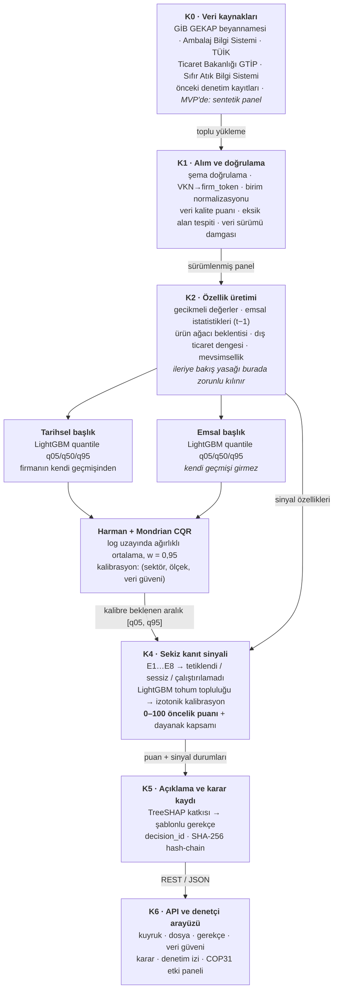
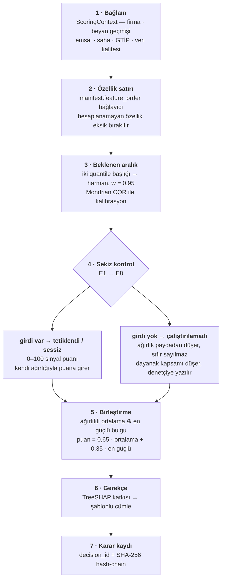

# Algoritma Akışı

**GÜS-DEDEKTİV** · Takım KinetiX · TEKNOFEST 2026 Sıfır Atık ve Döngüsel Ekonomi
Model `gus-ml-1.0.0` · Veri `1.0.0` · Politika `policy-2026.1` · Analiz birimi **firma-çeyrek**

> **Baskıya uygun sürüm:** [`ALGORITMA-AKISI.pdf`](ALGORITMA-AKISI.pdf) (8 sayfa, A4)

---

> [!IMPORTANT]
> **0–100 puan operasyonel bir inceleme önceliğidir. İhlal, suç veya usulsüzlük
> olasılığı değildir.** Sistem otomatik ceza kararı üretmez; nihai karar yetkili
> insan denetçiye aittir. Bu dokümandaki bütün ölçümler **sentetik** bir panel
> üzerinde alınmıştır ve gerçek beyanlar üzerindeki performansın kanıtı değildir.

---

## 1. Uçtan uca akış

Yedi katman. Her katman bir üstündekine yalnızca **tanımlı bir çıktı** verir;
aşağıdaki bir katman yukarıdakinin iç durumunu görmez. Bu ayrım değerlendirmeyi
dürüst tutan şeydir: özellik üretimi, anomali üretimini *ithal edemez* ve bu
kural veri doğrulayıcıda AST analiziyle otomatik denetlenir.



Aynı diyagramın yüksek çözünürlüklü hali: [`assets/algoritma-akisi.png`](../assets/algoritma-akisi.png)

---

## 2. Bir firma-çeyrek kaydı nasıl puanlanır

Aşağıdaki yedi adım tek bir `(firma, dönem)` kaydı için çalışır ve sonuçta puanı,
aralığı, gerekçeyi ve karar kimliğini birlikte üretir.



### 2.1 · Bağlam toplanır

Motor veritabanını hiç görmez. Kendisine `ScoringContext` verilir — düz veri
sınıfları olarak firma, beyan geçmişi, emsal kohortu, saha gözlemleri, GTİP
satırları ve veri kalitesi.

```
ScoringContext(company, declarations[], peers[], observations[], gtip[], quality)
```

### 2.2 · Özellik satırı kurulur

`manifest.json` içindeki `feature_order` ve `categories` **bağlayıcıdır**:
çalışma zamanı matrisi onlardan yeniden kurar. Uyuşmazlık olsaydı LightGBM
yanlış sütunu okur ve saçmadan kendinden emin bir tahmin üretirdi; bu yüzden
çalışma zamanı, manifest olmadan **yüklenmeyi reddeder**.

Hesaplanamayan bir özellik **eksik bırakılır**. Nötr bir değere doldurulup
gözlenmiş gibi puanlanmaz.

### 2.3 · Beklenen aralık üretilir

```
ŷ      = exp( w · log1p(ŷ_hist) + (1−w) · log1p(ŷ_peer) ) − 1 ,  w = 0,95
[a, b] = ŷ ± konformal_genişlik( sektör, ölçek, veri_güveni )
```

Grup önce `(sektör, ölçek, veri güveni)` üçlüsüyle aranır; o grupta yeterli
kalibrasyon verisi yoksa sırayla daha geniş gruba, en sonunda global gruba
düşülür.

> Eksiği **aralığın ortasına** değil **alt sınırına** göre ölçüyoruz. Ortaya göre
> ölçmek, aralığın içinde kalan her beyanı da bir miktar "eksik" göstermek olurdu.

### 2.4 · Sekiz kontrol çalıştırılır

Her kontrol üç durumdan birini bildirir. **Çalıştırılamadı, sessizden farklı bir
sonuçtur** ve öyle raporlanır.

| Durum | Anlamı |
| --- | --- |
| 🔴 **tetiklendi** | Kontrol çalıştı ve eşiği aştı. Puana kendi ağırlığıyla girer. |
| 🟢 **sessiz** | Kontrol çalıştı, eşiği aşmadı. Puana sıfır katkıyla girer. |
| ⚪ **çalıştırılamadı** | Gereken girdi yok. **Ağırlığı paydadan düşürülür** — sıfır sayılmaz. Bunun yerine **dayanak kapsamı** düşer ve bu, puanın yanında yazılır. |

### 2.5 · Puan birleştirilir

```
ağırlıklı_ortalama = Σ( aᵢ · wᵢ · sᵢ ) / Σ( aᵢ · wᵢ )
en_güçlü           = max( sᵢ )   ( aᵢ = 1 olanlar arasında )
puan               = (1 − p) · ağırlıklı_ortalama + p · en_güçlü ,  p = 0,35

aᵢ = 1 kontrol çalıştıysa, 0 çalıştırılamadıysa
wᵢ = politikadaki ağırlık        sᵢ = kontrolün 0–100 puanı
```

> Harman olmasaydı, **tek bir konuda sürekli hatalı** olan bir firma, dört konuda
> az hatalı olan bir firmanın altında sıralanırdı. Bir denetim ekibi böyle triyaj
> yapmaz.

### 2.6 · Gerekçe yazılır

Katkılar, **gerçekten çalışan model üzerinde** TreeSHAP ile hesaplanır, sinyal
düzeyine toplanır ve şablonlu cümlelere dökülür. Her cümle arkasındaki sayıyı
taşır: *"gümrük satırları 2.125 t ambalaj ima ediyor, beyan 1.328 t, aralığın
%38 altında."*

Serbest üretimli dil modeli kullanılmaz. Aynı girdi aynı cümleyi üretir.

### 2.7 · Karar kaydı zincire eklenir

```
digestₙ = SHA256( digestₙ₋₁ ‖ firma ‖ denetçi ‖ işlem ‖ önceki_durum ‖ yeni_durum ‖ not ‖ zaman )
```

Geçmiş bir kaydı değiştirmek veya silmek, o kaydın ve **ondan sonraki her bağın**
özetini değiştirir. `GET /api/audit/verify` zincirin kendisiyle uyuşmayı bıraktığı
**ilk sıra numarasını** bildirir.

---

## 3. Sekiz kanıt sinyali

"Sekiz **bağımsız** sinyal" denmez — sinyaller korelasyonludur. "Sekiz **ayrı
kanıt sinyali**" denir. Aralarındaki ilişki korelasyon matrisi, ablation testi,
SHAP katkı analizi, alt grup performansı ve duyarlılık analiziyle ölçülür.

| Kod | Kontrol | Neyle karşılaştırır | Model | Ağırlık |
| --- | --- | --- | --- | ---: |
| `E1` | Geçmişe göre eksik beyan | Beyanı, firmanın kendi geçmiş beyan örüntüsüyle | `S1` | 0,20 |
| `E2` | Yapısal eksik beyan | Beyanı, üretiminin ima ettiği hacimle | `S5` | 0,18 |
| `E3` | Emsalden sapma | Ambalaj yoğunluğunu, aynı sektör ve ölçek sınıfıyla | `S2` | 0,15 |
| `E4` | Üretim ile beyan uyumsuzluğu | Üretimdeki hareketi, beyandaki hareketle | `S4` | 0,14 |
| `E5` | Dönemler arası tutarsızlık | Yoğunluğun dönemler boyunca kararlılığını | `S6` | 0,09 |
| `E7` | Saha çelişkisi | Saha gözlemlerini, beyan edilenle | `S8` | 0,09 |
| `E8` | Gümrük tarife kanıtı | GTİP satırlarının ima ettiği ambalajı, beyanla | `S3` | 0,08 |
| `E6` | Beyan örüntüsü | Yuvarlama, tekrar ve eşik davranışını (kural motoru) / malzeme bileşiminin dönemler arası hareketini (model) | `S7` | 0,07 |

> E6, sekizi içinde en gevşek eşleşmedir: kural motoru beyandaki yuvarlama ve
> tekrarı okur, model ise malzeme bileşiminin dönemler arasında nasıl hareket
> ettiğini. İkisi de "bildirilen rakamlar kendi içinde tutarlı mı" sorusunu
> sorduğu için E6 **yönteme değil soruya göre** adlandırılmıştır ve panel
> hangisinin çalıştığını yazar.

### Öncelik bantları · `policy-2026.1`

| Bant | Aralık | Anlamı |
| --- | ---: | --- |
| **Kritik** | 75 – 100 | Kuyruğun başı; dayanak güçlü ve tutar yüksek |
| **Yüksek** | 50 – 74 | İncelenmeli, sırası kapasiteye göre |
| **Orta** | 25 – 49 | İzlenir |
| **Düşük** | 0 – 24 | Bu dönem için işlem gerekmiyor |

### Eşikler ve ağırlıklar koddan ayrıdır

Yukarıdaki ağırlıklar, bantlar ve harman oranı **politikadır**. Yetkili kurum
bunları kaynak koda dokunmadan `GET`/`PUT /api/scoring/policy` üzerinden
değiştirebilir. Politikada kapatılan bir sinyal **modelde de kapanır**: girdileri
birleştirme çalışmadan önce maskelenir, böylece puan, operatörün geri çektiği
kanıtı sessizce kullanmaya devam etmez.

---

## 4. Uygulamanın koruduğu dört kural

1. **Hesaplanamayan özellik, hesaplanmış gibi davranmaz.** Bir özellik
   üretilemiyorsa ona dayanan kontroller *çalıştırılamadı* olur ve nedeni yazılır.

2. **Aralık, kalibrasyon verisi inceldikçe genişler.** Kaydın kendi veri güveni,
   konformal gruplama boyutlarından biridir. Kötü kanıtlanmış bir firmaya dar bir
   aralık vermek, denetçiyi yanlış kapıya gönderen hata biçimidir.

3. **Eksik veri aklanma değildir.** Çalıştırılamayan bir kontrol puan taşımaz,
   ama **katkı taşıyabilir**: model, kontrol edilemeyen dosyaların daha sık eksik
   beyan taşıdığını veriden öğrenir. Denetçi panelinde bu durum kelimelerle
   yazılır — sessizce "temiz" sayılmaz.

4. **Kimlik özellikleri risk puanına girmez.** İl hiçbir yerde kullanılmaz.
   Sektör ve ölçek bandı yalnızca *beklenti* başlıklarında ve konformal
   gruplamada kullanılır; oradaki işleri karşılaştırmayı adil yapmaktır. Bedeli
   ölçüldü ve yoktur: PR-AUC 0,2141 → 0,2169; test Precision@100 0,350 → 0,350.

---

## 5. Çalışma zamanı: bir isteğin izlediği yol

```
POST /api/scoring/run { "period": "2026Q2" }
  │
  ├─ resolve_engine()          → SCORING_ENGINE=ml, artefaktlar ve lightgbm var mı?
  │                              yoksa kural motoruna düşülür, yanıt bunu söyler
  ├─ her firma için
  │    ├─ ScoringContext kurulur      (ORM burada kalır, motor görmez)
  │    ├─ engine.score(context)       → ScoreOutcome
  │    └─ sonuç + decision_id yazılır
  └─ özet: kaç kayıt, hangi motor, kaç ms

GET  /api/inspection-queue       → sıralanmış kuyruk, filtreli ve sayfalı
GET  /api/companies/{id}         → puan, aralık, sekiz kontrol, kanıt
POST /api/companies/{id}/review  → karar; hash-chain'e eklenir
GET  /api/audit/verify           → her bağ yeniden hesaplanır
```

Motor bir **arayüzdür**, iki uygulaması da depodadır:

| Dosya | Rol |
| --- | --- |
| `backend/app/scoring/base.py` | Sözleşme: `ScoringContext` girer, `ScoreOutcome` çıkar |
| `backend/app/scoring/mock_scorer.py` | Deterministik kurallar — referans ve yedek |
| `backend/app/scoring/ml_scorer.py` | Eğitilmiş model; artefaktlar varken devrede |
| `backend/app/scoring/ml_runtime.py` | Artefaktları okur ve çalıştırır (yalnız numpy + lightgbm) |
| `backend/app/scoring/ml_features.py` | `ScoringContext` → modelin eğitildiği özellik satırı |
| `backend/app/scoring/registry.py` | Seçim ve motor hazır değilse geri çekilme |

İkisi de aynı `ScoreOutcome` döndürdüğü için **motoru değiştirmek arayüzde hiçbir
değişiklik gerektirmez**.

---

## 6. Ölçülen sonuçlar

> [!WARNING]
> Aşağıdaki bütün sayılar **sentetik** bir panel üzerinde, zamansal bir holdout
> ile ölçülmüştür: 2025Q2'ye kadar eğitim, 2025Q3–Q4 kalibrasyon, 2026Q1–Q2
> üzerinde **bir kez** ölçüm. Bunlar henüz gerçek beyanlar üzerindeki performansın
> kanıtı değildir.
>
> **Hedefimiz, üretimde kurumun kendi ortamında tutulan gerçek ve
> anonimleştirilmiş beyan verisiyle aynı sonuçlara ulaşmaktır.** Pilot dönemde
> aynı zamansal holdout protokolü — aynı bölümleme, aynı metrikler, aynı bootstrap
> güven aralıkları — gerçek veri üzerinde tekrarlanacak ve iki ölçüm yan yana
> yayımlanacaktır.

**Test bölümü · n = 1.200 · taban oran %8,08**

| Ölçüt | GÜS-DEDEKTİV | En iyi basit taban | Kat |
| --- | ---: | ---: | ---: |
| Precision@100 | 0,360 | 0,190 | 4,5× |
| Precision@50 | 0,500 | — | 6,2× |
| PR-AUC | 0,328 | 0,159 | 2,1× |
| ROC-AUC | 0,674 | — | — |
| Recall@100 | 0,371 | — | — |

**Belirsizlik ve kalibrasyon**

| Ölçüt | Hedef | Gözlenen |
| --- | ---: | ---: |
| Konformal kapsama (valid) | 0,900 | 0,917 |
| Konformal kapsama (test) | 0,900 | 0,883 |
| Ortanca bağıl aralık genişliği | — | 0,873 |
| Brier skoru | — | 0,066 |
| Beklenen kalibrasyon hatası (ECE) | — | 0,022 |

**Kavramsal kayma testi.** `A08_dis_kanit_uyumsuz` mekanizması eğitimde nadir,
testte sıktır; bu **kasıtlı** bir kayma testidir. Modelin bu mekanizmadaki 17
doğrulanmış vakanın **10'unu ilk 50'de**, 12'sini ilk 100'de yakalaması, eğitimde
görmediği bir davranışa karşı tamamen kör olmadığını gösterir.

**Dar örneklem uyarısı.** Eğitim penceresinde yalnızca 246 pozitif örnek vardır.
Precision@100 için bootstrap güven aralığı `[0,26 – 0,45]`'tir ve metrik her yerde
bu aralıkla birlikte raporlanır.

Tam model kartı: [`ml/reports/MODEL_KARTI.md`](../ml/reports/MODEL_KARTI.md)

---

## PDF'i yeniden üretmek

PDF, `docs/pdf/algoritma-akisi.html` dosyasından basılır. Tek kaynak, iki çıktı:
baskı için açık tema, README görseli için `?theme=dark&only=flow`.

```bash
chrome --headless=new --no-pdf-header-footer --virtual-time-budget=20000 \
  --print-to-pdf=docs/ALGORITMA-AKISI.pdf \
  file:///$PWD/docs/pdf/algoritma-akisi.html
```
